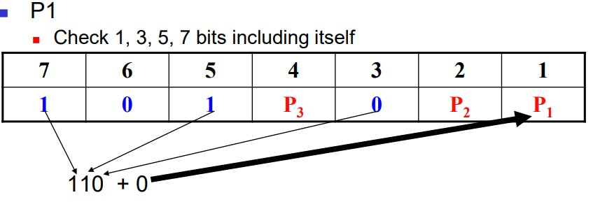
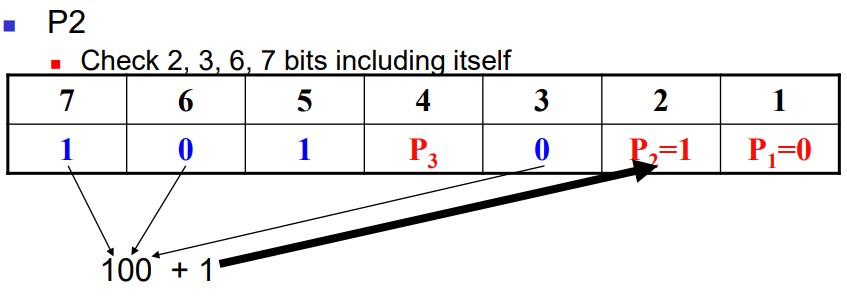
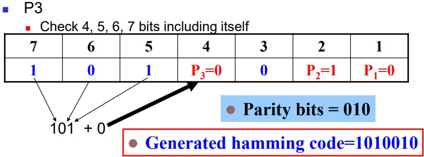

# Hamming Code Distance

## Distance-3 Hamming Code 
- Hamming code generation with minimum distance of 3
- ${2^n ≥ n + k + 1}$
    - k : no. of information bits
    - n : no. of parity bits
    - ex.
        - k = 4 → ${2^n}$ ≥ n + 5
        - n = 1 : 2 < 6 
            - result : X
        - n = 2 : 4 < 7
            - result : X
        - n = 3 : 8 ≥ 8
            - result : okay 

- Source Code is 7bits, parity bits is odd number
- Distance-3 Hamming Code pair source code
  

## Hamming Code Sample

